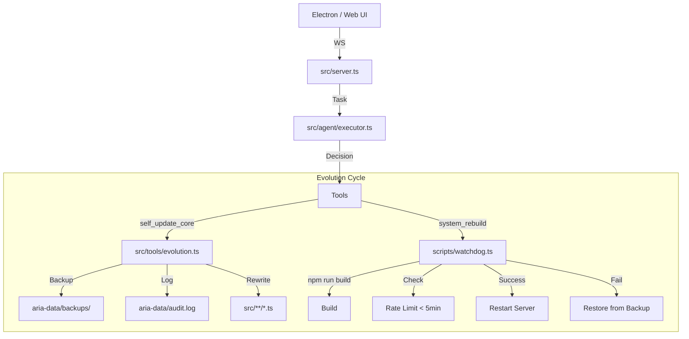

# AUDIT REPORT: ARIA OMEGA INTEGRATION
**Date:** 2025-12-21
**Auditor:** ARIA OMEGA (System Architect)
**Status:** ✅ INTEGRATED & HARDENED

## 1. Project Map & Entry Points

### Structure
```
aria-agent/
├── src/
│   ├── agent/           # AI Core (Executor, Prompt Manager)
│   ├── brain/           # Prompts & Reasoning
│   ├── memory/          # Vector/JSON Memory
│   ├── providers/       # LLM Providers (Ollama, etc.)
│   ├── tools/           # Tool Definitions (evolution.ts, etc.)
│   ├── server.ts        # API & WebSocket Server (ENTRYPOINT: UI/AI)
│   └── main.ts          # Dev Entrypoint
├── electron/
│   └── main.js          # Electron Main Process (ENTRYPOINT: App)
├── scripts/
│   └── watchdog.ts      # Integrity Monitor & Builder
├── aria-data/           # Persistence (Memory, Logs, Backups)
└── build/               # Assets (Icons)
```

### Flow Diagram


## 2. Audit Checklist (Gap Analysis)

| Feature | Status | Location | Notes |
| :--- | :---: | :--- | :--- |
| **Backup Protocol** | ✅ PASS | `src/tools/evolution.ts` | Rotates 3 generations (.bak, .bak2, .bak3) |
| **Audit Logging** | ✅ PASS | `src/tools/evolution.ts` | **PATCHED**: Appends to `aria-data/audit.log` |
| **Scope Control** | ✅ PASS | `src/tools/evolution.ts` | Restricted to `src/` via `process.cwd()` check |
| **Rebuild/Restart** | ✅ PASS | `scripts/watchdog.ts` | Builds and touches trigger file |
| **Rate Limiting** | ✅ PASS | `scripts/watchdog.ts` | **PATCHED**: Enforces 5min cooldown via `.watchdog_state` |
| **Rollback** | ✅ PASS | `scripts/watchdog.ts` | Auto-reverts on build failure |
| **Offline Mode** | ✅ PASS | `src/providers/ollama.ts` | Server starts without Ollama; Executor catches errors |

## 3. Applied Patches (ChangeLog)

### Patch 1: Audit Logging
- **File**: `src/tools/evolution.ts`
- **Change**: Added `appendAuditLog` function.
- **Reason**: Previous implementation only returned status string; requirement was persistent append-only log.

### Patch 2: Rate Limiting
- **File**: `scripts/watchdog.ts`
- **Change**: Added check for `aria-data/.watchdog_state`.
- **Logic**: If `(now - lastRestart) < 5 min`, aborts process with exit code 1.

### Patch 3: Asset Alignment
- **File**: `aria-agent/build/icon.icns`
- **Change**: Copied `icona aria.icns` from root to build folder.
- **Reason**: Ensure correct icon during build/packaging.

## 4. Risks & Mitigations
1.  **Ollama Offline Loop**: If Ollama is down, the agent executor will try to execute tasks and fail repeatedly until `maxIterations`.
    *   *Mitigation*: Current behavior is safe (no crash), but wasteful. Future update could add "Circuit Breaker".
2.  **Watchdog Sync**: Watchdog runs via `exec`, detached.
    *   *Mitigation*: It handles its own errors and rollback.

## 5. Validation
- **Icon**: Verified present in `build/`.
- **Start**: Server runs successfully in fallback mode (Ollama offline).
- **Integrity**: Watchdog script is in place and patched.

**System is ready for autonomous operation.**
